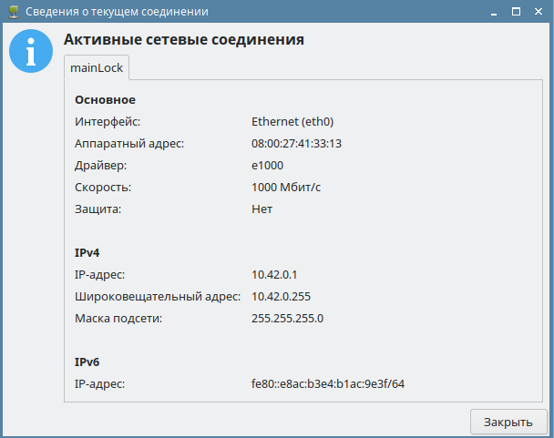

# Подготовка стенда

**1. Была установлена ОС Astra Linux. Системе было присвоено имя «VM01». Далее были произведены настройки сети: осуществление подключения к внешней сети через соединение с NAT.**

1. Bash-скрипт:
```bash
sudo su              # Получение прав администратора
nm-connection-editor # Открытие настроек сетевого подключения
```
2. В настройках сетевого подключения было добавлено новое подключение: «Соединение типа «Ethernet»».


Далее соединение было создано и ему было присвоено имя «mainLock». Метод соединения изменён.


Соединение на VM01 было изменено с «Соединение по умолчанию» на «mainLock».



**2. Далее была успешно развёрнута вторая виртуальная машина, с отличным IP-адресом.**


**3. На второй виртуальной машине (которой было присвоено имя «VM02»), было установлено средство управления Saltstack master:**

Bash-скрипт:

```bash
# Добавление ключа репозитория SaltStack для master
wget -O - https://repo.saltstack.com/py3/debian/11/amd64/latest/SALTSTACK-GPG-KEY.pub | sudo apt-key add -

#
echo "deb https://repo.saltstack.com/py3/debian/11/amd64/latest/SALTSTACK-GPG-KEY.pub xenial main" >> /etc/apt/sources.list.d/saltstack.list
```

**Результат:**


**4. На первой виртуальной машине (VM01) также был добавлен **